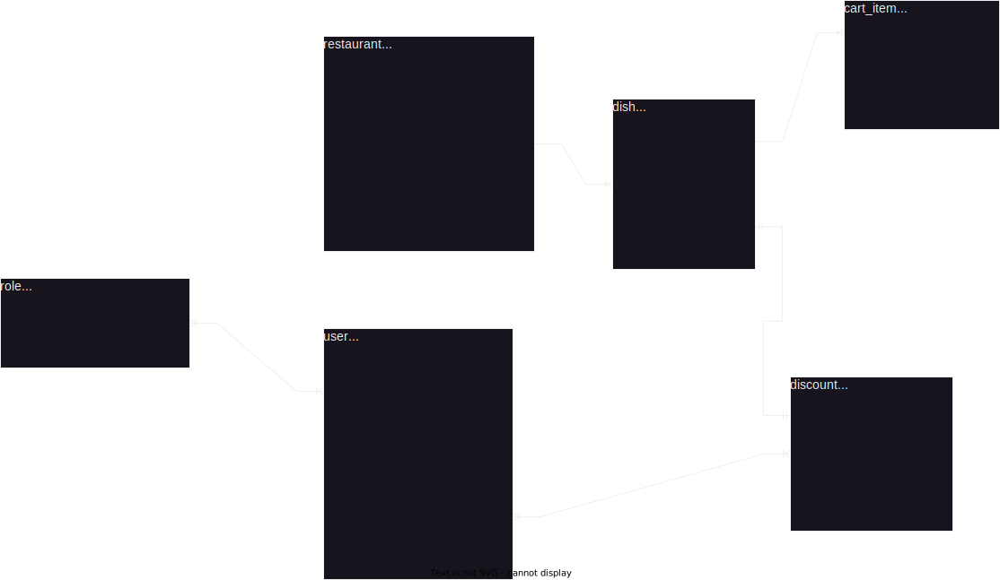
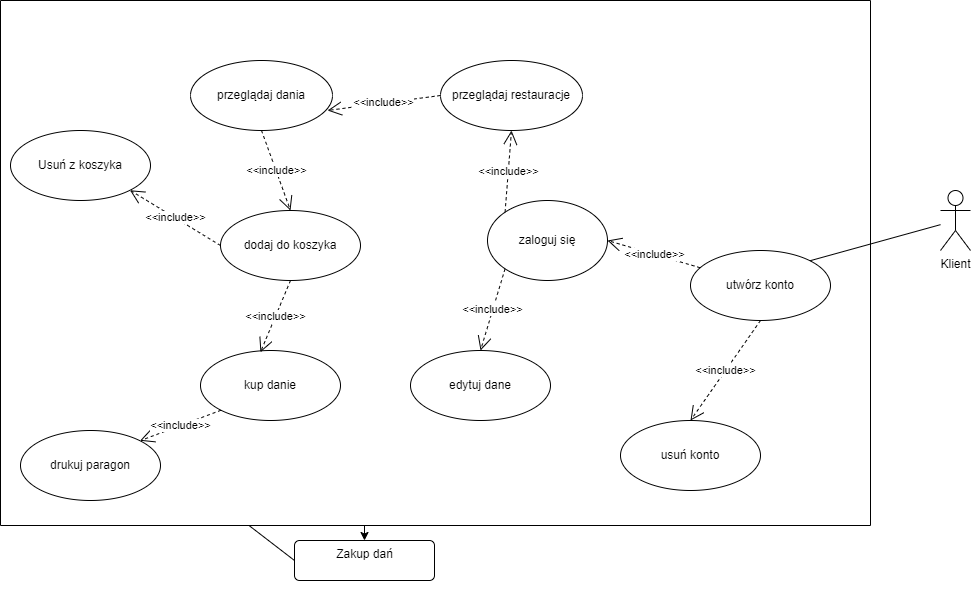

# ShamanWebApp

# Polish

## Diagram ERD bazy danych



## Diagram Przypadków użycia



## Architektura oprogramowania

### Aplikacja webowa

Jest to standartowa architektura dla [angulara](https://angular.io/). W folderze [app](./web/src/app) znajdują się kolejno foldery:

1) [models](./web/src/app/models) zawierający modele obiektów odbieranych z API,
2) [services](./web/src/app/services) zawieracjący serwisy odpowiedzialne za rzeczy takie jak np. serializacja danych odbieranych z API,
3) [components](./web/src/app/components) zawierający komponenty, lub strony angulara.

### API

API napisane jest w języku Java. Pracuje na frameworke'u [spring](https://spring.io/) .Zawiera architekturę wygenerowaną za pomocą [maven](https://maven.apache.org/). Platforma [JPA](https://spring.io/projects/spring-data-jpa) odpowiedzialna jest za mapowanie obiektowo-relacyjne i wszelkie interackję aplikacji z bazą danych.  W folderze [shamanApi](./api/src/main/java/com/example/shamanApi) znajdują się kolejno foldery:

1) [controler](./api/src/main/java/com/example/shamanApi/controler) - kontrolery obsługujące endpointy
2) [converter](./api/src/main/java/com/example/shamanApi/converter) - klasy odpowiadające za konwersję danych
3) [data](./api/src/main/java/com/example/shamanApi/data) - klasy odpowiadające za obsługę bazy danych 
4) [dto](./api/src/main/java/com/example/shamanApi/dto) - modele odpowiadające za transwer danych między api a klientem
5) [exception](./api/src/main/java/com/example/shamanApi/exception) - wyjątki
6) [extension](./api/src/main/java/com/example/shamanApi/extension) - klasy z [metod rozszerzających](https://learn.microsoft.com/en-us/dotnet/csharp/programming-guide/classes-and-structs/extension-methods) będące zaporzyczeniem z języka C#
7) [factory](./api/src/main/java/com/example/shamanApi/factory) - klasy stworzone za pomocą wzorca projektowego [Factory](https://refactoring.guru/design-patterns/factory-method)
8) [model](./api/src/main/java/com/example/shamanApi/model) - modele encji z bazy danych
9) [ReceiptPrinter](./api/src/main/java/com/example/shamanApi/ReceiptPrinter) - obsługa drukowania paragonu
10) [repository](./api/src/main/java/com/example/shamanApi/repository) - klasy odpowiadające za mappowanie obiektowo-relacyjne i pracę z danymi z bazy
11) [security](./api/src/main/java/com/example/shamanApi/security) - klasy korzystające ze [spring security](https://spring.io/projects/spring-security) obsługujące autoryzację użytkowników
12) [service](./api/src/main/java/com/example/shamanApi/service) - serwisy odpowiadające za obróbkę danych

## Uruchamianie API

Aby uruchomić api użyj polecenia:

```
./mvnw spring-boot:run
```

## Uruchamianie Aplikacji Webowej

**Jeśli uruchamiasz aplikację pierwszy raz, użyj wcześniej komendy `npm install`.**

Wpisz `ng serve` aby uruchomić serwer. Przejdź do `http://localhost:4200/`. Aplikacja będzie się odświeżać przy każdej zmianie plików źródłowych.

# English

## Run API

To run API you need to execute following command

```
./mvnw spring-boot:run
```

## Run Web App

**If you running app first time, run `npm install` before.** 

Run `ng serve` for a dev server. Navigate to `http://localhost:4200/`. The application will automatically reload if you change any of the source files.
